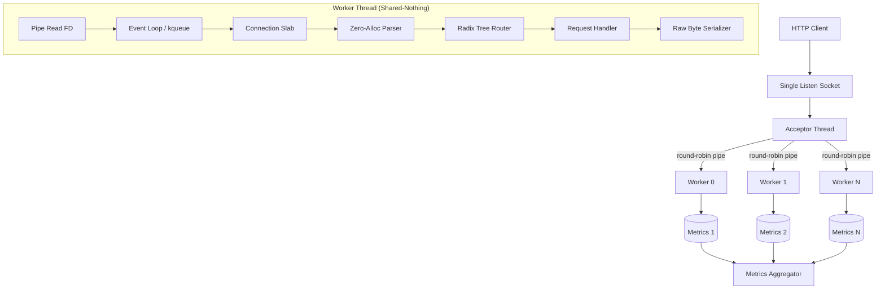

# Chopin Architecture Documentation

Chopin is a high-performance, Shared-Nothing HTTP framework built for maximum per-core throughput. It achieves **280k+ req/s** on a single core by bypassing heavyweight runtimes and minimizing cross-thread synchronization.

## 🏛️ Core Design Principles

### 1. Shared-Nothing Architecture
Chopin follows a "Shared-Nothing" model where each CPU core runs a completely independent worker thread.
- **Independent State**: Each worker has its own event loop, listening socket, connection pool (slab), and metrics.
- **No Global Locks**: There are no shared mutexes or atomics in the request/response hot path.
- **Cache Locality**: By pinning workers to specific cores, we maximize CPU cache hits and eliminate cross-core cache-line bouncing.

### 2. Thread-per-Core Model
- **Core Affinity**: Threads are pinned to logical cores using `core_affinity`.
- **SO_REUSEPORT**: The OS kernel balances incoming connections across workers at the socket layer.
- **Native Async**: Uses platform-native event notification (`kqueue` on macOS, `epoll` on Linux) through low-level `libc` syscalls.

## 🧱 Component Overview

### 🔀 Accept-Distribute Model
Unlike traditional `SO_REUSEPORT` (which suffers kernel contention on macOS), Chopin uses a dedicated **Acceptor Thread**:
1. A single listen socket handles all `accept()` calls
2. Accepted FDs are sent to workers via **Unix pipes** (round-robin)
3. Each worker registers the pipe read-end in its kqueue loop
4. Workers remain **100% independent** after receiving the FD — no shared state

### 📋 Connection Slab (`src/slab.rs`)
Chopin manages memory through a pre-allocated **Connection Slab**.
- **O(1) Allocation**: Getting a handle for a new connection is a simple array index lookup.
- **Fixed Size**: Memory usage is deterministic (100k slots by default).
- **Zero Memset**: Buffers are reused without clearing; state tracking ensures no data leaches between requests.

### ⚡ Zero-Allocation Request Pipeline
1.  **Parser (`src/parser.rs`)**: Slices the raw TCP buffer into standard HTTP fields. Uses `&str` slices instead of `String` allocations.
2.  **Router (`src/router.rs`)**: A Radix Tree (Prefix Tree) for O(path-length) routing. Route parameters are stored on a fixed-size stack array during matching.
3.  **Serializer (`src/worker.rs`)**: Responses are written directly into the `write_buf` using raw byte copies (`copy_from_slice`). It avoids the overhead of `std::fmt` and vtable dispatches.

## 🚀 Performance Optimizations

### 1. Memory Management
- **Stack Arrays**: Headers and route parameters use fixed-size stack arrays instead of `Vec` or `HashMap`.
- **64-Byte Alignment**: Essential structures like `Conn` and `WorkerMetrics` are `#[repr(align(64))]` to prevent **False Sharing**.

### 2. Syscall Efficiency
- **Non-Blocking I/O**: Direct interaction with `libc::read` and `libc::write`.
- **Partial Writes**: The framework handles `EWOULDBLOCK` by tracking `write_pos` and resuming on the next `EPOLLOUT` event.
- **Vectored I/O**: Supports `writev()` to send headers and body chunks without concatenating them into a single buffer.

### 3. Metric Partitioning
Metrics are partitioned per worker. An aggregator thread periodically sums these atomics to report global throughput, ensuring zero contention during the request loop.

## 🔄 Request Lifecycle

1.  **Accept**: Worker is notified of a new connection; takes a slot from the `ConnectionSlab`.
2.  **Read**: Bytes flow into `read_buf`.
3.  **Parse**: `parse_request` tokenizes the buffer (zero allocation).
4.  **Route**: `Router` matches the method/path and pulls parameters into a stack array.
5.  **Handle**: User-defined `Handler` executes.
6.  **Serialize**: Response bytes are copied directly to `write_buf`.
7.  **Flush**: `libc::write` flushes bytes to the socket.
8.  **Repeat**: If `Keep-Alive`, reset `parse_pos` and wait for more data. Otherwise, close.
