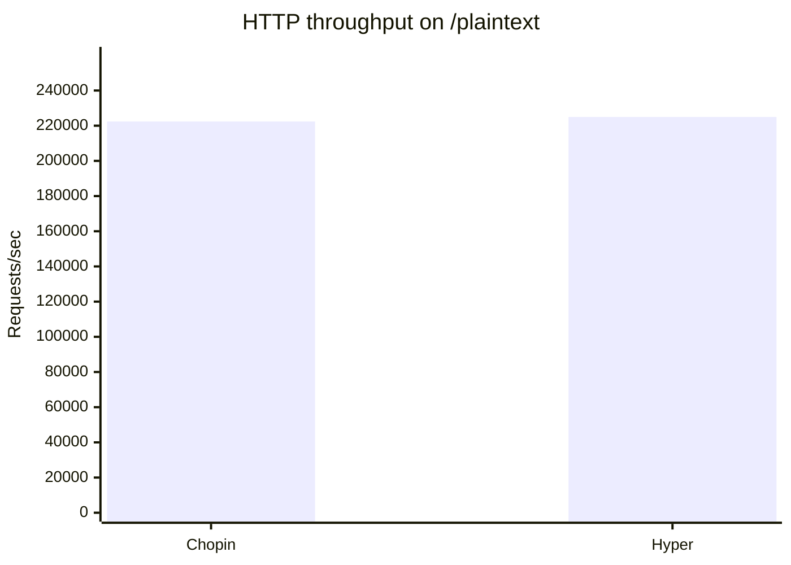

# Chopin vs Hyper HTTP Benchmark

Generated by `benchmarks/compare_hyper.sh` on 20260526_104926.

## Configuration

- URL: `http://127.0.0.1:18080/plaintext`
- Threads: 10
- Connections: 512
- Warmup: 5s
- Duration: 30s

## Throughput

Higher is better.

| Framework | Requests/sec | Relative to Chopin |
|-----------|-------------:|-------------------:|
| Chopin | 222415.38 | 1.00x |
| Hyper | 224958.36 | 1.01x |

## Raw Results

- [Chopin](../results/bench_chopin_20260526_104926.txt)
- [Hyper](../results/bench_hyper_20260526_104926.txt)

