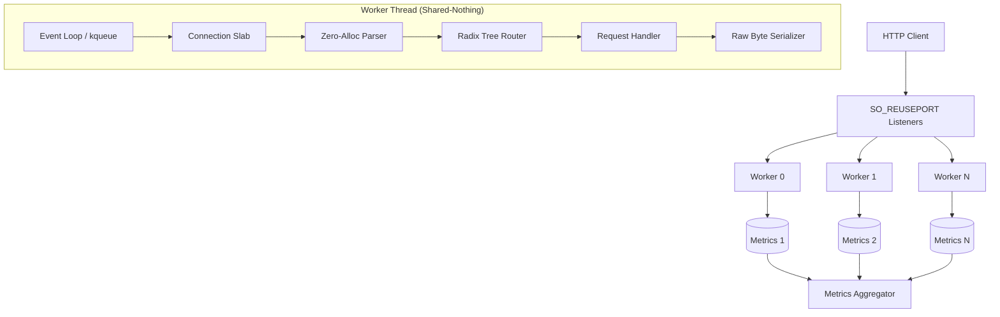

# Chopin Architecture (Codename: nocturne-op9-no2)

Chopin is a high-performance, Shared-Nothing HTTP framework built for maximum per-core throughput. It achieves industry-leading efficiency and scales linearly across multiple cores by bypassing heavyweight runtimes and minimizing cross-thread synchronization.

## 🏛️ Core Design Principles

### 1. Shared-Nothing Architecture
Chopin follows a "Shared-Nothing" model where each CPU core runs a completely independent worker thread.
- **Independent State**: Each worker has its own event loop, listening socket, connection pool (slab), and metrics.
- **No Global Locks**: There are no shared mutexes or atomics in the request/response hot path.
- **Cache Locality**: By pinning workers to specific cores, we maximize CPU cache hits and eliminate cross-core cache-line bouncing.

### 2. Thread-per-Core Model
- **Core Affinity**: Threads are pinned to logical cores using `core_affinity`.
- **SO_REUSEPORT**: The OS kernel balances incoming connections across workers at the socket layer. Each worker manages its own listen socket file descriptor.
- **Native Async**: Uses platform-native event notification (`kqueue` on macOS, `epoll` on Linux) through low-level `libc` syscalls.

## 🧱 Component Overview

### ⚡ Shared-Nothing Model
Chopin eliminates the kernel locking overhead typically found in multi-threaded servers:
1. Every worker thread creates its own listening socket with `SO_REUSEPORT`.
2. The kernel distributes incoming TCP connections directly to the worker's own `accept()` call.
3. Workers remain **100% independent** — there is no inter-thread communication (no queues, no pipes, no locks) during request processing.

### 📋 Connection Slab (`crates/chopin-core/src/slab.rs`)
Chopin manages memory through a pre-allocated **Connection Slab** per worker.
- **O(1) Allocation**: Getting a handle for a new connection is a simple array index lookup.
- **Fixed Size**: Memory usage is deterministic (10,000 slots per worker by default).
- **Zero Memset**: Buffers are reused without clearing; state tracking ensures no data leaches between requests.

### ⚡ Zero-Allocation Request Pipeline
1.  **Parser (`crates/chopin-core/src/parser.rs`)**: Slices the raw TCP buffer into standard HTTP fields. Uses `&str` slices instead of `String` allocations.
2.  **Router (`crates/chopin-core/src/router.rs`)**: A Radix Tree (Prefix Tree) for O(path-length) routing. Route parameters are stored on a fixed-size stack array during matching. At startup, `finalize()` pre-composes all middleware chains — the hot path calls one pre-built `Arc<dyn Fn>` with zero per-request allocation.
3.  **Serializer (`crates/chopin-core/src/worker.rs`)**: Response headers are written into `write_buf` using raw byte copies. Static and byte bodies are **not** copied into the write buffer; instead, a pointer is retained and flushed via `writev` (headers + body in one syscall). File bodies are transferred in kernel space via `sendfile`. `Body::Raw` responses bypass all header serialization entirely — one `memcpy` then one `write(2)`.

### 🗄️ Thread-Local Buffer Pool (`crates/chopin-core/src/bufpool.rs`)
Chopin maintains a per-thread free-list of `Vec<u8>` buffers. On JSON serialization, chunked encoding, or other short-lived allocations, `bufpool::get()` returns a recycled buffer instead of allocating from the OS. Buffers larger than 256 KiB are discarded on return; the pool holds up to 8 buffers per worker thread. Zero synchronization — each worker's pool is `thread_local!`.

### 🔌 I/O Filter Architecture (`crates/chopin-core/src/filter.rs`)
An optional composable filter layer sits between raw socket I/O and the event loop. Each `Filter` implements `process_read` and `process_write`. A `FilterStack` holds up to three filters inline (stack-allocated) before spilling to heap. Built-in filters: `PassthroughFilter` (identity) and `LoggingFilter` (byte-count tracing). This architecture enables transparent logging, metrics, and future compression layers.

### 🔒 TLS Integration (`crates/chopin-core/src/tls.rs`)
When built with the `tls` feature flag, Chopin integrates rustls for in-worker TLS 1.2/1.3 termination. The TLS session (`Conn::tls_session`) is embedded directly in the per-connection slab slot. Reads and writes go through a `TlsStream` wrapper that maintains the rustls state machine. No separate TLS proxy or sidecar is required.

### 🌐 WebSocket Support (`crates/chopin-core/src/websocket.rs`)
Full RFC 6455 implementation: upgrade handshake validation, `Sec-WebSocket-Accept` key derivation (SHA-1 + Base64), frame codec (decode/encode), and high-level `WsMessage` assembly from fragmented frames. Client masking is validated per the RFC. Maximum frame payload is 16 MiB (configurable constant).

### ⚡ Experimental io_uring Backend (`crates/chopin-core/src/worker_uring.rs`)
When built with `--features io-uring` on Linux, a `UringWorker` replaces the epoll event loop. It uses a raw mmap'd io_uring ring with direct `io_uring_setup` / `io_uring_enter` syscalls. Multi-shot accept (kernel ≥5.19) submits one SQE that generates a CQE per accepted connection. User-data encodes `(conn_idx << 8) | op_type` for O(1) dispatch. This backend is experimental; SQPOLL and fixed buffers are prepared but not default-enabled.

## 🚀 Performance Optimizations

### 1. Memory Management
- **Stack Arrays**: Headers and route parameters use fixed-size stack arrays instead of `Vec` or `HashMap`.
- **64-Byte Alignment**: Essential structures like `Conn` and `WorkerMetrics` are `#[repr(align(64))]` to prevent **False Sharing**.
- **Thread-Local Buffer Pool**: Short-lived `Vec<u8>` allocations for JSON serialization and chunked encoding are recycled across requests per worker thread.

### 2. Syscall Efficiency & Zero-Allocation Hot-Paths
Chopin minimizes syscall overhead and memory pressure:
- **writev Header+Body Flush**: Response headers and body are delivered in a single `writev` syscall. Static (`&'static [u8]`) and allocated byte bodies bypass the write buffer — no memcpy.
- **sendfile File Serving**: `Response::file()` uses `sendfile` (Linux) / `sendfile` (macOS) to transfer file contents directly in kernel space. The user-space process never touches the file bytes.
- **Body::Raw Ultra-fast Path**: Pre-baked full HTTP responses bypass all header serialization — one memcpy into `write_buf`, one `write(2)` syscall.
- **Zero-Alloc kqueue/epoll**: Registers events using stack-allocated arrays, eliminating heap fragmentation in the event loop.
- **TCP_NODELAY Inheritance**: `TCP_NODELAY` is set on the **listener** and inherited by all accepted sockets, saving one `setsockopt` syscall per connection.
- **Platform Optimizations**:
    - **Linux**: Uses `SOCK_NONBLOCK` (atomic socket creation), `TCP_DEFER_ACCEPT` (holds connection until data arrives), and `TCP_FASTOPEN`.
    - **macOS**: Uses `SO_NOSIGPIPE` and `TCP_FASTOPEN`.
- **Atomic Socket Creation**: On Linux, `socket` + `SOCK_NONBLOCK` + `SOCK_CLOEXEC` reduces the need for multiple `fcntl` calls.

### 3. Metric Partitioning
Metrics are partitioned per worker. An aggregator thread periodically sums these atomics to report global throughput, ensuring zero contention during the request loop. A Prometheus text-format endpoint (`Chopin::with_metrics(path)`) and a JSON health probe (`Chopin::with_health(path)`) are available as opt-in builder methods.

## 🔄 Request Lifecycle

1.  **Accept**: Worker is notified of a new connection on its private listen FD; takes a slot from the `ConnectionSlab`.
2.  **Read**: Bytes flow into `read_buf`. If TLS is active, decrypted via `TlsStream`.
3.  **Parse**: `parse_request` tokenizes the buffer (zero allocation).
4.  **Route**: `Router` matches the method/path and pulls parameters into a stack array. Returns the pre-composed `BoxedHandler` if middleware is present.
5.  **Handle**: User-defined `Handler` executes (invoked directly, or via the pre-composed middleware chain). WebSocket upgrades return a `101` response here.
6.  **Serialize**: Response headers are encoded into `write_buf`. Body pointer is retained for zero-copy delivery. `Body::Raw` skips this step entirely.
7.  **Flush**: `libc::writev` delivers headers + body in one syscall. For `Body::File`, Phase 2 uses `sendfile` for kernel-space transfer. TLS responses go through `TlsStream::write`.
8.  **Repeat**: If `Keep-Alive`, reset `parse_pos` and wait for more data. Otherwise, close.

## 📦 Component Map

| Module | Purpose |
|--------|---------|
| `worker.rs` | epoll/kqueue event loop; request → response pipeline |
| `worker_uring.rs` | Experimental io_uring event loop (Linux, `io-uring` feature) |
| `parser.rs` | Zero-alloc HTTP/1.1 request parser |
| `router.rs` | Radix tree router; middleware pre-composition |
| `http.rs` | `Request`, `Response`, `Body`, `Method`, `OwnedFd` |
| `headers.rs` | `Headers` stack-array container; `IntoHeaderValue` trait |
| `conn.rs` | Per-connection state (`Conn` slab slot) |
| `slab.rs` | O(1) connection slab allocator |
| `bufpool.rs` | Thread-local `Vec<u8>` recycling pool |
| `filter.rs` | Composable I/O filter trait + `FilterStack` |
| `websocket.rs` | RFC 6455 WebSocket upgrade + frame codec |
| `tls.rs` | rustls TLS 1.2/1.3 integration (`tls` feature) |
| `syscalls.rs` | `writev`, `sendfile`, `epoll_*`, `io_uring_*` wrappers |
| `timer.rs` | O(1) timer wheel for connection timeouts |
| `metrics.rs` | Per-worker atomics; Prometheus scrape handler; health handler |
| `multipart.rs` | RFC 7578 streaming multipart parser |
| `openapi.rs` | OpenAPI 3.0 JSON generation + Scalar UI handler |
| `extract.rs` | `Json<T>` and `Query<T>` extractors (`FromRequest` trait) |
| `server.rs` | `Chopin` builder; `Server` multi-thread launcher |
